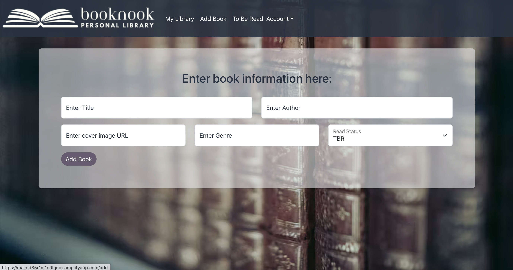
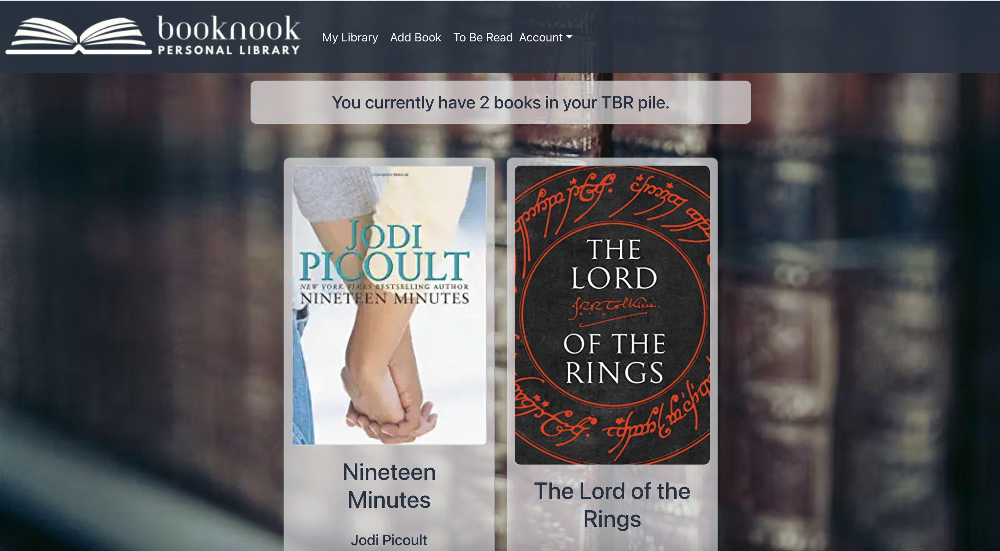

<!-- using a README template found at https://github.com/Louis3797/awesome-readme-template -->

<div align="center">

  
  <h1>BookNook Personal Library</h1>
  
  <p>
    A great web app for keeping track of the books you own and want to read! 
  </p>
  
  
<!-- Badges -->
<p>
  <a href="https://github.com/andeewarren/BookNook-library/graphs/contributors">
    
  </a>
  <a href="">
    
  </a>
  <a href="">
    
  </a>
  <a href="https://github.com/andeewarren/BookNook-library/issues">
    
  </a>
</p>
   
<h4>
    <a href="https://main.d35r1m1c9lqedt.amplifyapp.com/">View Demo</a>
  <span> · </span>
    <a href="https://github.com/andeewarren/BookNook-library">Documentation</a>
  <span> · </span>
    <a href="https://github.com/andeewarren/BookNook-library/issues">Report Bug</a>
  <span> · </span>
    <a href="https://github.com/andeewarren/BookNook-library/issues">Request Feature</a>
  </h4>
</div>

<br />

<!-- Table of Contents -->
# :notebook_with_decorative_cover: Table of Contents

- [About the Project](#star2-about-the-project)
  * [Screenshots](#camera-screenshots)
  * [Tech Stack](#space_invader-tech-stack)
  * [Features](#dart-features)
  * [Color Reference](#art-color-reference)
- [Getting Started](#toolbox-getting-started)
  * [Prerequisites](#bangbang-prerequisites)
  * [Installation](#gear-installation)
  * [Running Tests](#test_tube-running-tests)
  * [Run Locally](#running-run-locally)
- [Usage](#eyes-usage)
- [Roadmap](#compass-roadmap)
- [Contributing](#wave-contributing)
- [FAQ](#grey_question-faq)
- [Contact](#handshake-contact)
- [Acknowledgements](#gem-acknowledgements)

  

<!-- About the Project -->
## :star2: About the Project


<!-- Screenshots -->
### :camera: Screenshots

<div align="center"> 
  
</div>
<div>
  <p>
    
    
  </p>
 </div>


<!-- TechStack -->
### :space_invader: Tech Stack

<h4>Client</h4>
  <ul>
    <li><a href="https://reactjs.org/">React.js</a></li>
    <li><a href="https://react-bootstrap.github.io/getting-started/introduction/">React-Bootsrap</a></li>
  </ul>


<!-- Features -->
### :dart: Features

- Include genre and whether the book has been read
- See books marked as "to be read"

<!-- Color Reference -->
### :art: Color Reference

| Color             | Hex                                                                |
| ----------------- | ------------------------------------------------------------------ |
| Primary Color |  #263342 |
| Secondary Color |  #E4E5E7 |
| Accent Color |  #685C71 |
| Text Color |  #FEFFF7 and  #263342 |


<!-- Getting Started -->
## 	:toolbox: Getting Started

<!-- Prerequisites -->
### :bangbang: Prerequisites

This project uses Node.js as package manager

```bash
 npm install -g npm
```

<!-- Installation -->
### :gear: Installation

Install my-project with npm

```bash
  npm install my-project
  cd my-project
```

   
<!-- Running Tests -->
### :test_tube: Running Tests

To run tests, run the following command

```bash
  npm test
```

<!-- Run Locally -->
### :running: Run Locally

Clone the project

```bash
  git clone https://github.com/andeewarren/BookNook-library.git
```

Go to the project directory

```bash
  cd my-project
```

Install dependencies

```bash
  npm install
```

Start the server

```bash
  npm start
```


<!-- Deployment -->
<!-- ### :triangular_flag_on_post: Deployment

To deploy this project run

```bash
  yarn deploy
``` -->


<!-- Usage -->
## :eyes: Usage

Use this app to keep a digital record of books owned, with information such as the author and grnre, as well as if it's been read.


<!-- Roadmap -->
## :compass: Roadmap

* [ ] Add ability to sort by title, author or genre
* [ ] Create collections for more than TBR


<!-- Contributing -->
## :wave: Contributing

Contributions are always welcome!


<!-- FAQ -->
## :grey_question: FAQ

- Why did you decide to build this app instead of something different?

  + I love collecting books but my memory isn't that great, so it's difficult when I'm at the bookstore and can't always remember if I own this book or I've read that book. Having a digital library keeps track of that for me. I also haven't found a similar app that I like for various reasons. The entry is always tedious, but I'd like to at least have something nice to look at while I work.

- What are your plans for this app in the future?

  + I want to add more functionality to the book list. I'd like to be able to sort and filter, as well as edit a book directly from its entry rather than deleting it and starting over. I'd also love to develop this into a mobile app once I have the knowledge.


<!-- Contact -->
## :handshake: Contact

Andee Warren - [@LinkedIn](https://www.linkedin.com/in/andeewarren/)

Project Link: [https://github.com/andeewarren/BookNook-library](https://github.com/andeewarren/BookNook-library)


<!-- Acknowledgments -->
## :gem: Acknowledgements

Use this section to mention useful resources and libraries that you have used in your projects.

 - [Awesome README Template](https://github.com/Louis3797/awesome-readme-template)
 - [Shields.io](https://shields.io/)
